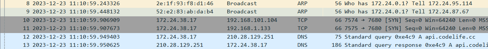
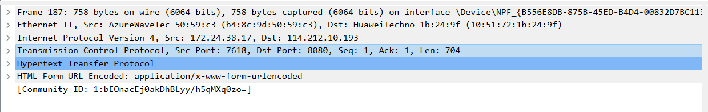

---
author:
- 221501029潘泓旭
date: '221501029\@smail.nju.edu.cn'
title: pcaplab
---

1.ARP,TCP,DNS\

{width="\\textwidth"}

2\. 0.801927-0.641993=0.159934s\

{width="\\textwidth"}

3.我电脑的IP是172.24.38.17;Get报文的发送端口号是7596,Post报文的发送端口号是7618\

{width="100%"} {width="100%"}

4\.

{width="100%"}

{width="100%"}
