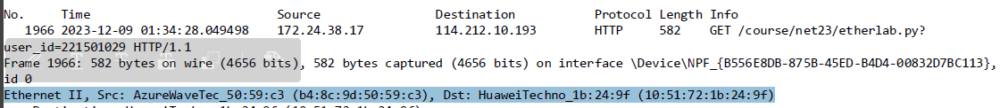
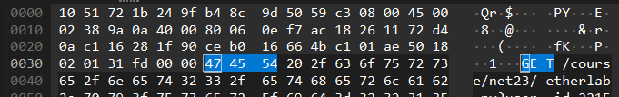
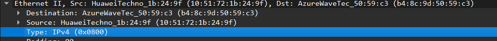
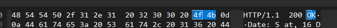
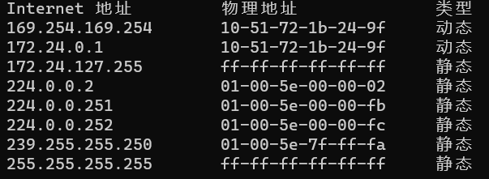
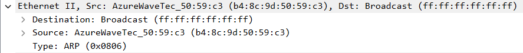
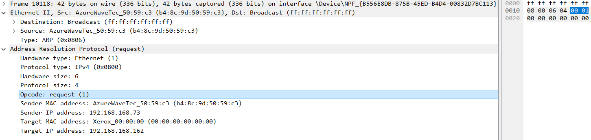
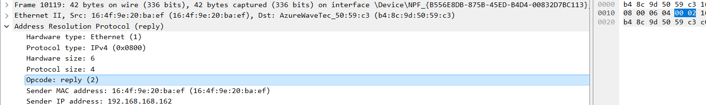
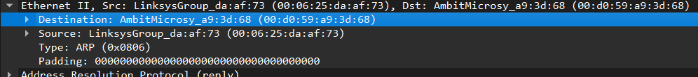
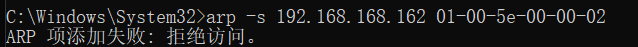

---
author:
- 221501029 潘泓旭
date: '221501029\@smail.nju.edu.cn'
title: etherlab
---

1\.   b4:8c:9d:50:59:c3  
2\.   10:51:72:1b:24:9f，不是，它是路由器的地址

3\.   0x800;IP 协议

4\.   55

5\.  51:72:1b:24:9f，都不是，是我路由器的地址，是用来进我子网的链路  
6\.  b4:8c:9d:50:59:c3，是  
7\.  0x800,IP 协议

8\.  有 13 个字节

9\.  Internet 地址，物理地址，类型

10\.  源地址是 b4:8c:9d:50:59:c3，目的地址是 ff:ff:ff:ff:ff:ff  
11\.  0x0806,ARP 协议  

12\.  
a)20  
b)0x0001  
c) 包含  
d) 设置 Target Mac address 为 00:00:00:00:00:00,Target IP  
address 为 192.168.168.162

13\.  
a)20  
b)0x0002  
c)Sender MAC address 为 16:4f:9e:20:ba:ef,Target IP  
address 为 192.168.168.162  
14\.  源地址为 16:4f:9e:20:ba:ef，目的地址为 b4:8c:9d:50:59:c3

15\.  因为 ARP 广播信息是广播的，所有该网段内的电脑均可收到，而 ARP
广播回复是单播的，只有请求的那台电脑才能收到，因此抓不到另外一台电脑的
ARP 请求。

EX1.会显示"ARP 项添加失败：拒绝访问。"

EX2.
根据微软官方文档 http://support.microsoft.com/kb/949589，并没有 ARP 缓存保留默认时间
