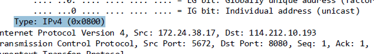

---
author:
- 221501029潘泓旭
date: '221501029\@smail.nju.edu.cn'
title: etherlab
---

1\. b4:8c:9d:50:59:c3\
2. 10:51:72:1b:24:9f,不是,它是路由器的地址\

{width="100%"}

3\. 0x800;IP协议\

{width="100%"}

4\. 55\

{width="100%"}

:51:72:1b:24:9f,都不是,是我路由器的地址,是用来进我子网的链路\
6.b4:8c:9d:50:59:c3,是\
7.0x800,IP协议\

{width="100%"}

8.有13个字节\

{width="100%"}

9.Internet地址,物理地址，类型\

{width="100%"}

10.源地址是b4:8c:9d:50:59:c3,目的地址是ff:ff:ff:ff:ff:ff\
11.0x0806,ARP协议\

{width="100%"}

12.a)20\
b)0x0001\
c)包含\
d)设置Target Mac address为00:00:00:00:00:00,Target IP
address为192.168.168.162

{width="100%"}

13.a)20\
b)0x0002\
c)Sender MAC address为16:4f:9e:20:ba:ef,Target IP
address为192.168.168.162\
14.源地址为16:4f:9e:20:ba:ef,目的地址为b4:8c:9d:50:59:c3\

{width="100%"}

15.因为 ARP 广播信息是广播的，所有该网段内的电脑均可收到，而 ARP
广播回复是单播的，只有请求的那台电脑才能收到，因此抓不到另外一台电脑的
ARP 请求。\

{width="100%"}

EX1.会显示\"ARP 项添加失败: 拒绝访问。\"\

{width="100%"}

EX2.
根据微软官方文档http://support.microsoft.com/kb/949589,并没有ARP缓存保留默认时间\
