---
author:
- 221501029 潘泓旭
date: '221501029@smail.nju.edu.cn'
title: tcpiplab
---

1\.  我的 ID:172.24.38.17,TCP 端口:2952

2\.  服务器端口:8080

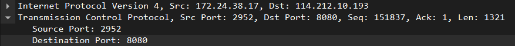

3\.  TCP(6)

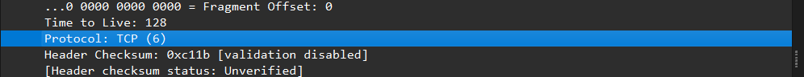

4\.  20bytes，有效负载为总长度 - 报头长度=1341

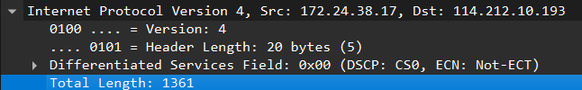

5\.  没分段，因为 Don't fragment 是 Set,More fragments 是 Not set,
fragment offset 也为 0

6\.   59195,128

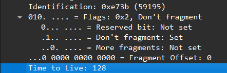

7.相对序列号为 151837，绝对序列号为 2818240797;根据三次握手，客户端发送 SYN 请求来建立连接
,我找到发送的第一个请求并且发现我电脑把 SYN 标为 151837 从而建立连接，sequence
number:2818240797 是个随机值，以上是三次握手的第一步

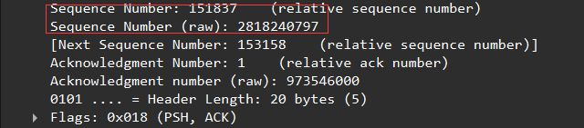

8\.  381,153158(2818242118)Acknowledge number 是前面那个的 Next Sequence
Number;
意思是服务器收到连接请求并且发送 SYN-ACK 确认，这是三次握手第二步骤

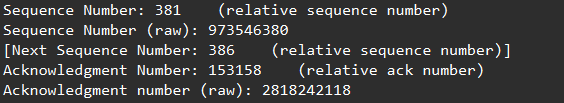

9\.  1

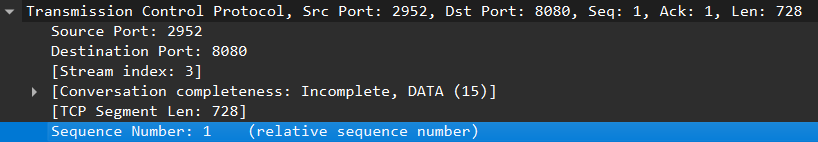

10\.  如表所示;

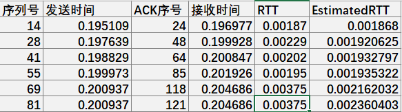

EstimatedRTT=0.875*EstimatedRTT+0.125*SampleRTT

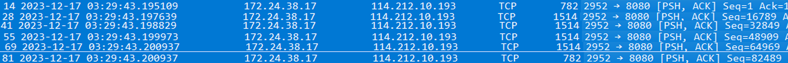

11\.  由 ACK 号，可知长度各为 
1)729-1=728  
2)18249-729=17520  
3)34309-18429=15880  
4)50369-34309=16060  
5)66429-50369=16060  
6)83217-66429=16788 

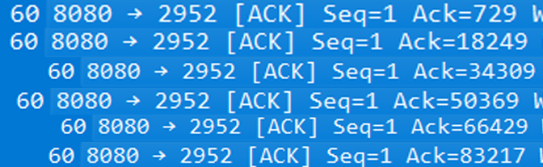

12\.  30720 字节 (只需看第一个确认 (窗口递增)),发送器永远不会因为接收器缓冲区空间不足而被抑制  
13\.  没有，为此我检查了 TCP 数据段的序列号，发现是单调递增的  

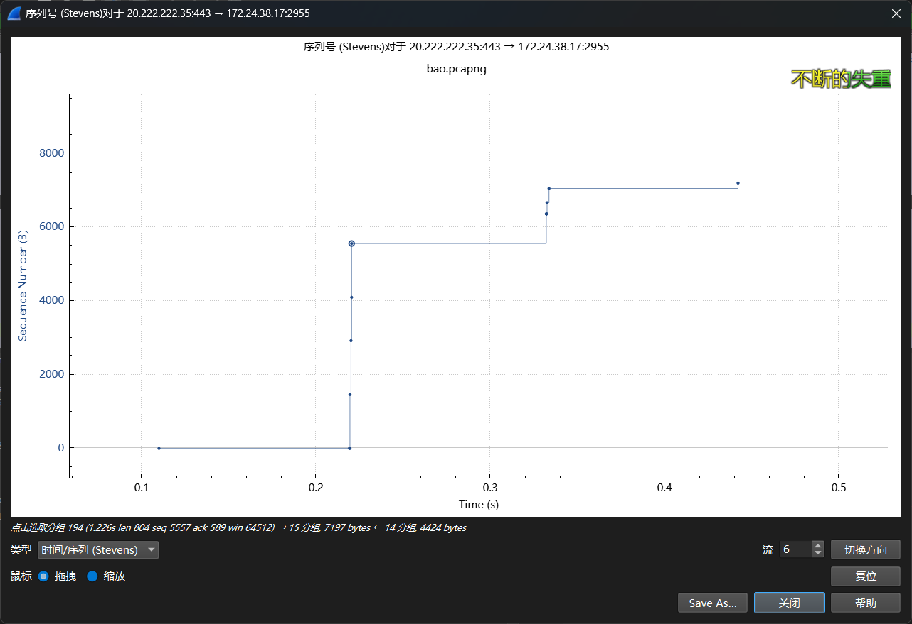

14\.  1460，注意到大致都是 1460 的倍数 (16060=1460*11,17520=1460*12)  
比 1460 大就可以识别发晚了的情况，我这里就都是这样的 (汗颜)  
15\.  可以通过第一个 TCP 数据的序列号和最后一个 ACK 的序列号计算，此处取六个好了  
(121-14)/(0.204686-0.195109)=11172.6(字节/秒)

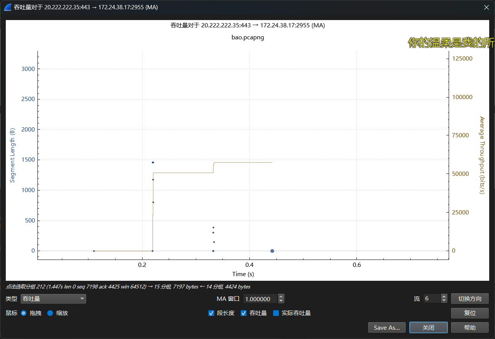
